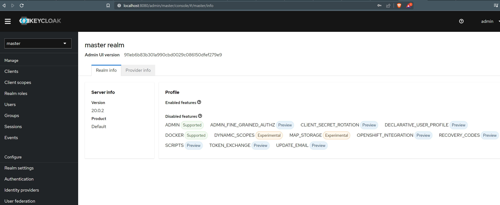
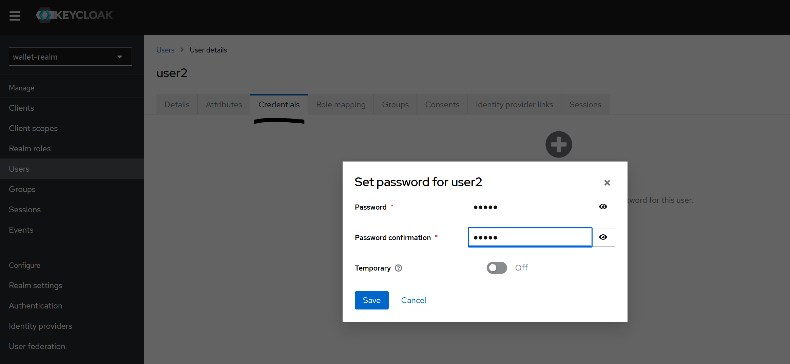
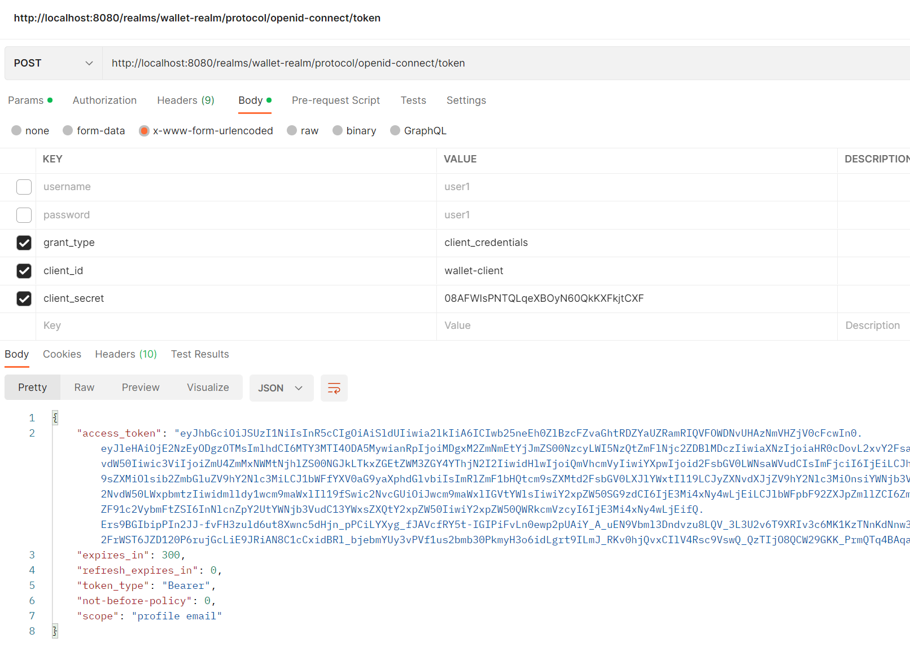

# securing_microservices_with_Keycloak

##  1. <a name='Installingandrunningkeycloak.'></a>Installing and running `keycloak`.

- Link : https://www.keycloak.org/downloads

- We can install keycloak using multiple ways, but I am goin to use the [Docker image](https://quay.io/repository/keycloak/keycloak).

- Starting the container in dev mode :

```
$ docker run quay.io/keycloak/keycloak start-dev
```
- OR

```
$  docker run --name mykeycloak -p 8080:8080 -e KEYCLOAK_ADMIN=admin -e KEYCLOAK_ADMIN_PASSWORD=change_me quay.io/keycloak/keycloak:latest start-dev
```


- Visiting : `http://localhost:8080/`


- Login to administrator console : [username: admin, password: change_me]




- If we did not create a user already in running, we can create it after accessing keycloak.

##  2. <a name='Usingkeycloak'></a>Using `keycloak`

- To create a Realm :


- Click Create > enter name (I named it 'wallet-realm') + enable > "create and access realm".

###  2.1. <a name='WhatisaClient'></a>What is a `Client` ?


- No we can add our application to be secured : **`Clients`**


- Let's create "wallet-client" (client ID) client, I keep all that by default values except :
    - **Client ID** : 'wallet-client'
    - **Home URL** : Refers to the Home URL of my application [Ex: `http://localhost:4200` for my Angular App].
    - **Valid redirect URIs**: `http://localhost:4200/*`,
    - **Valid post logout redirect URIs** : `http://localhost:4200`
    - **Web origins**: `*` => Authorize any page from any URL to send requests to Keycloak .. That should be more specified to be more secure.
- Now have just created a 'Client' which is an application to be secured.


###  2.2. <a name='CreatingUsers'></a>Creating `Users` ?

- Create User


- Setup Password via Credentials



- **Temporary** in password creation means if the user is required to change the password after login or not.


###  2.3. <a name='CreatingRoles'></a>Creating Roles 
- Via `Realm roles` we can create roles.


- And affect the roles to users via `role mapping` in each user > `Assign role`.


- In this case our `User1` has [ADMIN, USER] and `User2` has [USER] roles.

##  3. <a name='TestingwithPostman'></a>Testing with Postman 

- Here we will simulate the behavior that, we will consult keycloak from our application.
- We will use directly `Postman` as tool.
- In our `Realm Settings` we can  access the `OpenID Endpoints configuration`.
- There we can find the address to use : `token_endpoint : http://localhost:8080/realms/wallet-realm/protocol/openid-connect/token`.

- We will use this address in postman with :
    - Header
    ```json
    {"Content-Type" : "application/x-www-form-urlencoded"}
    ```
    - Body
    ```json
    {"username":"user1",
    "password" :"user1",
    "grant_type":"password",
    "client_id": "wallet-client"}
    ```

- By the `grant_type` we specify the type of credentials we use.
- `client_id` is the id of the Keycloak Client we want to access.


- We can see our Token info (Pyload Data) by encoding it (access_token) on the : https://jwt.io/

```json
{
  "exp": 1671286465,
  "iat": 1671286165,
  "jti": "253560a2-08ef-4a8e-9074-5dd5586ca7ec",
  "iss": "http://localhost:8080/realms/wallet-realm",
  "aud": "account",
  "sub": "ddff8207-c7aa-48ef-b724-1562d06e0d7b",
  "typ": "Bearer",
  "azp": "wallet-client",
  "session_state": "89f2a912-a741-4402-b8da-8c6bf257c1dc",
  "acr": "1",
  "allowed-origins": [
    "*"
  ],
  "realm_access": {
    "roles": [
      "offline_access",
      "ADMIN",
      "uma_authorization",
      "default-roles-wallet-realm",
      "USER"
    ]
  },
  "resource_access": {
    "account": {
      "roles": [
        "manage-account",
        "manage-account-links",
        "view-profile"
      ]
    }
  },
  "scope": "profile email",
  "sid": "89f2a912-a741-4402-b8da-8c6bf257c1dc",
  "email_verified": false,
  "name": "user1",
  "preferred_username": "user1",
  "given_name": "user1",
  "family_name": "",
  "email": "user1@gmail.com"
}
```

- In the diagram above, SPA = Single-Page Application; AS = Authorization Server; RS = Resource Server; AT = Access Token; RT = Refresh Token.

- We can use `refresh_token` as `grant_type` now, so no need to the `username` and `password`, but we should provide the `refresh_token` instead.


- Lets use another way to autheticate : `Client-id` and `Client-secret`

- To use that we sould 
    1. Activate `Client Authentication` in our Client.
    2. Check `Service accounts roles` in our Client.
    3. A tab will appears `Credentials`, where we can find the `Client secret`.


- We can use it like this :



